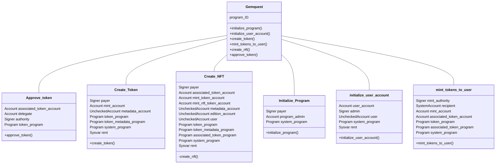

# Back-End de GemQuest

## Présentation

Le back-end de GemQuest repose sur du programme développé avec le framework Anchor sur la blockchain Solana. Ce programme gère toutes les interactions blockchain, incluant l'authentification, la création de tokens et de NFTs, et les transactions associées.

## Technologies Utilisées

- **Solana Blockchain** : Fournit une plateforme rapide et à faible coût pour les transactions décentralisées.
- **Anchor Framework** : Offre des outils et abstractions pour faciliter le développement et l'audit de programme sécurisés et efficaces.

## Structure du Programme

Le programme GemQuest intègre plusieurs contrats pour la gestion des tokens, des NFTs, et des interactions utilisateur. Voici les principales classes et leurs méthodes :

### Diagramme de Classe

## Déploiement et Maintenance

Le déploiement des programmes se fait via des commandes CLI fournies par Anchor, garantissant que les contrats sont correctement compilés et déployés sur le réseau Solana. La maintenance et les mises à jour du programme peuvent être gérées de manière centralisée, en assurant une compatibilité et sécurité continues.

