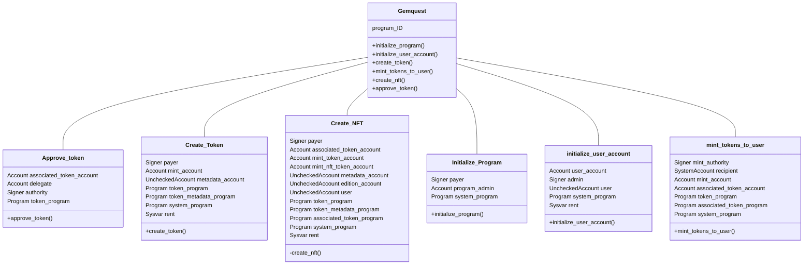
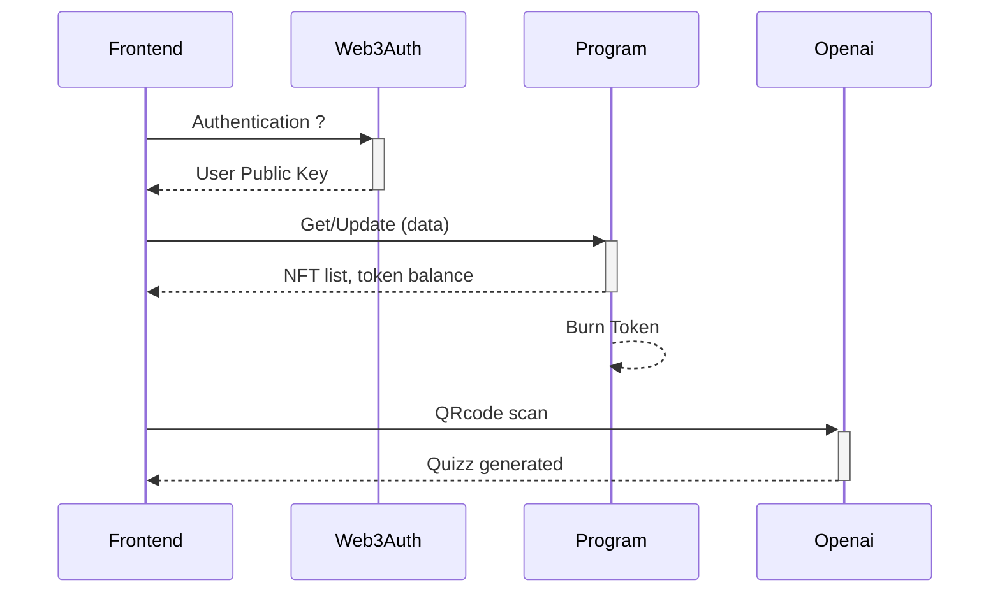
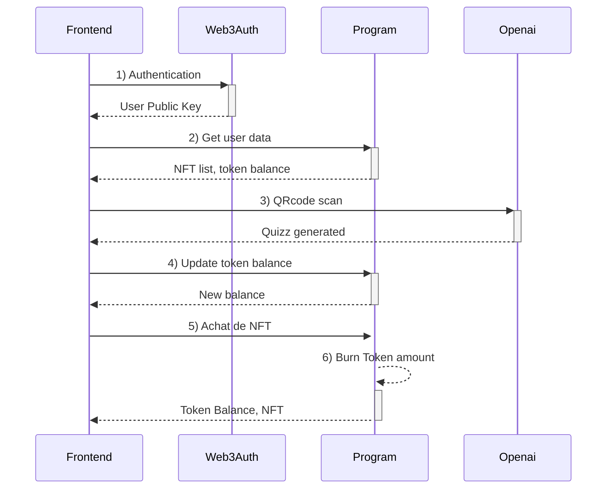

```mermaid
classDiagram
        Gemquest -- Approve_token : 
        Gemquest -- Create_Token
        Gemquest -- Create_NFT
        Gemquest -- Initialize_Program
        Gemquest -- initialize_user_account
        Gemquest -- mint_tokens_to_user
        Gemquest: program_ID
        Gemquest: +initialize_program()
        Gemquest: +initialize_user_account()
        Gemquest: +create_token()
        Gemquest: +mint_tokens_to_user()
        Gemquest: +create_nft()
        Gemquest: +approve_token()

        class Approve_token{
            Account associated_token_account
            Account delegate
            Signer authority
            Program token_program
            +approve_token()
        }

        class Create_Token{
            Signer payer
            Account mint_account
            UncheckedAccount metadata_account
            Program token_program
            Program token_metadata_program
            Program system_program
            Sysvar rent
            +create_token()
        }

        class Create_NFT{
            Signer payer
            Account associated_token_account
            Account mint_token_account
            Account mint_nft_token_account
            UncheckedAccount metadata_account
            UncheckedAccount edition_account
            UncheckedAccount user
            Program token_program
            Program token_metadata_program
            Program associated_token_program
            Program system_program
            Sysvar rent
            -create_nft()
        }

        class Initialize_Program{
            Signer payer
            Account program_admin
            Program system_program
            +initialize_program()
        }

        class initialize_user_account{
            Account user_account
            Signer admin
            UncheckedAccount user
            Program system_program
            Sysvar rent
            +initialize_user_account()
        }
        
        class mint_tokens_to_user{
            Signer mint_authority
            SystemAccount recipient
            Account mint_account
            Account associated_token_account
            Program token_program
            Program associated_token_program
            Program system_program
            +mint_tokens_to_user()
        }
```

```mermaid
    sequenceDiagram
        Frontend->>+Web3Auth: Authentication ?
        Web3Auth-->>-Frontend: User Public Key
        Frontend->>+Program: Get/Update (data)
        Program-->>-Frontend: NFT list, token balance
        Program-->>+ Program : Burn Token
        Frontend->>+Openai: QRcode scan
        Openai-->>-Frontend: Quizz generated
```

```mermaid
    sequenceDiagram
        Frontend->>+Web3Auth: 1) Authentication
        Web3Auth-->>-Frontend: User Public Key
        Frontend->>+Program: 2) Get user data
        Program-->>-Frontend: NFT list, token balance
        Frontend->>+Openai: 3) QRcode scan
        Openai-->>-Frontend: Quizz generated
        Frontend->>+Program : 4) Update token balance
        Program-->>-Frontend :  New balance
        Frontend->>+Program : 5) Achat de NFT
        Program-->>+Program : 6) Burn Token amount
        Program-->>-Frontend : Token Balance, NFT
```